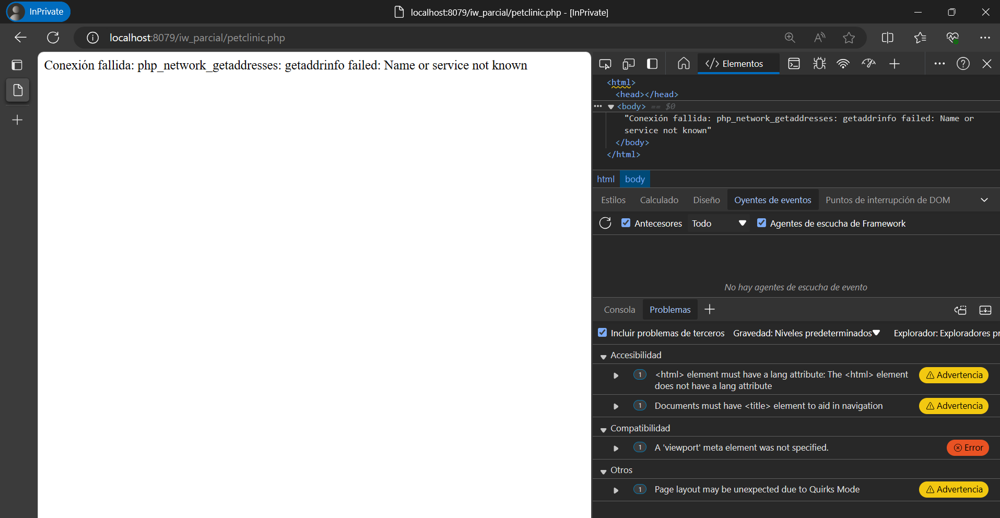
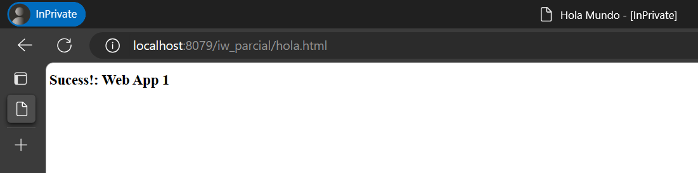
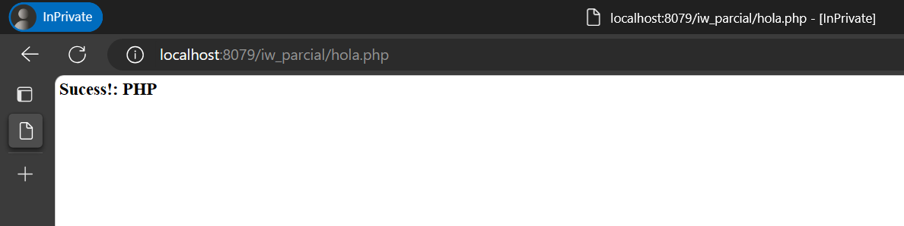

# Descripción del Proyecto

Este proyecto es un laboratorio que implica la creación de imágenes Docker y el despliegue de contenedores. El objetivo es crear una imagen Docker basada en Ubuntu GNU/Linux 18.04 que incluya un servidor web Apache HTTP server 2.x ejecutándose en segundo plano de forma continua.

La imagen Docker está configurada para alojar una aplicación web en `/mywebapps/webapp_01` con un alias de `/iw_parcial`. La aplicación web incluye una página de "Hola Mundo" en HTML (`hola.html`) y PHP (`hola.php`), así como una aplicación `petclinic.php` que realiza consultas simples a las tablas `pets` y `owners` de la base de datos `petclinic`.

La imagen Docker se construye a partir de un Dockerfile y se le asigna el nombre `iw_parcial_imagen`. A partir de esta imagen, se crea un contenedor que expone el servidor web en el puerto 8089. El contenedor se llama `iw_parcial_pregunta10` y se puede acceder a la aplicación web en `http://127.0.0.1:8089/iw_parcial/hola.html`.

Este proyecto es una excelente oportunidad para aprender y practicar con Docker, Apache, PHP y MySQL.

## Requisitos

- Docker
- Docker Compose

## Comandos para desplegar la solución

Para desplegar el contenedor Docker, primero necesitas construir la imagen Docker y luego ejecutarla. Aquí están los pasos:

1. Construir la imagen Docker: En la terminal, navega hasta el directorio que contiene el Dockerfile y ejecuta el siguiente comando:
Este comando construye una imagen Docker a partir del Dockerfile en el directorio actual (.) y le asigna el nombre iw_parcial_imagen.

```
docker build -t iw_parcial_imagen .
```

1. Ejecutar el contenedor Docker: Una vez que la imagen Docker se ha construido, puedes ejecutarla con el siguiente comando:
Este comando ejecuta un contenedor Docker a partir de la imagen iw_parcial_imagen, asigna el nombre iw_parcial_pregunta10 al contenedor y mapea el puerto 8089 del host al puerto 80 del contenedor.

```
docker run -p 8089:80 --name iw_parcial_pregunta10 iw_parcial_imagen
```

Después de ejecutar estos comandos, deberías poder acceder a la aplicación web en http://127.0.0.1:8089/iw_parcial/hola.html.

Nota: Asegúrate de tener Docker instalado y en funcionamiento en tu máquina antes de ejecutar estos comandos.

## Resultados

A continuación se muestran los resultados de acceder a los archivos dentro del localhost del contenedor Docker desplegado.

**Resultado de acceder a petclinic.php:**



**Resultado de acceder a hola.html:**



**Resultado de acceder a hola.php:**

