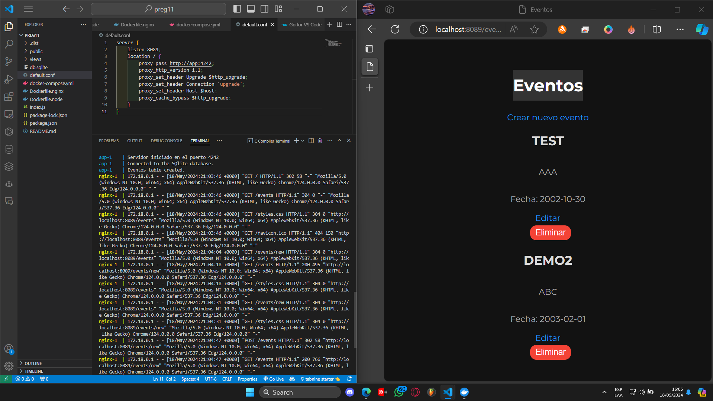
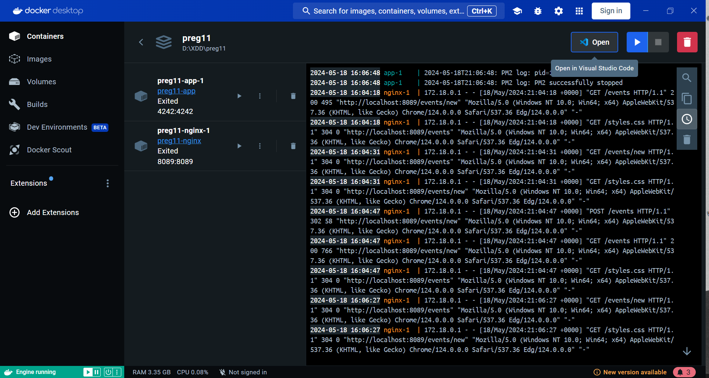

# Despliegue de una Aplicación NodeJS+Express en Producción

Este repositorio contiene los pasos necesarios para desplegar una aplicación NodeJS+Express en un entorno de producción utilizando Docker, PM2 y Nginx.

## Pasos para el despliegue

1. Asegúrate de tener Docker y Docker Compose instalados en tu máquina. Si no es así, puedes seguir las instrucciones de instalación en la [documentación oficial de Docker](https://docs.docker.com/get-docker/).

2. Clona este repositorio en tu máquina local.

    ```bash
    git clone <url del repositorio>
    ```

3. Navega al directorio del proyecto.

    ```bash
    cd <nombre del directorio del proyecto>
    ```

4. Construye y levanta los servicios definidos en el archivo `docker-compose.yml` con el siguiente comando:

    ```bash
    docker-compose up --build
    ```

    Este comando construirá la imagen de Docker para la aplicación Node.js y Nginx, y luego iniciará los contenedores.

5. Una vez que los contenedores estén en ejecución, puedes acceder a la aplicación en tu navegador web en `http://localhost:8089`.

## Comandos Docker

- `docker run -p 8089:4242 -d iw_parcial_pregunta11`: Este comando se utiliza para ejecutar el contenedor `iw_parcial_pregunta11` en modo detached (`-d`). El parámetro `-p 8089:4242` mapea el puerto 8089 de tu máquina local al puerto 4242 del contenedor.

- `docker-compose up --build`: Este comando se utiliza para construir y levantar todos los servicios definidos en el archivo `docker-compose.yml`.

## Imágenes

A continuación, se muestran algunas imágenes del despliegue:




